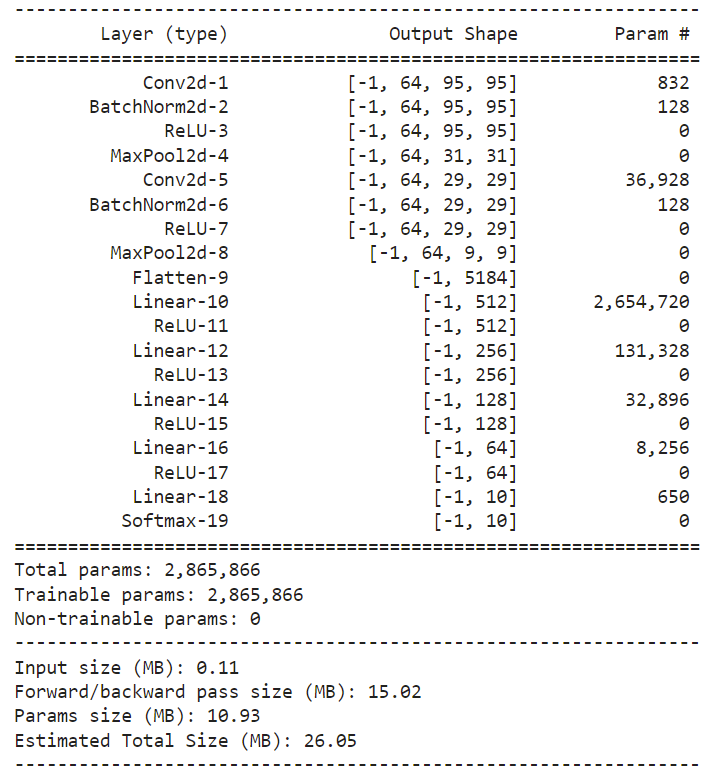

# Colorblind_AI
A CNN trained to answer colorblindness test questions.

## Dataset
The dataset is custom made using the [Ishihara Plate Generator](https://franciscouzo.github.io/ishihara/).
The images (14 each) gathered for each digit were then augmented using [image_modifications.ipynb](https://github.com/hannankhan888/Colorblind_AI/blob/main/image_modifications.ipynb).
The modifications resulted in 5599 images in total.  
The dataset was then split into train/test using [this](https://github.com/hannankhan888/Colorblind_AI/blob/main/create_train_test_sets_from_images.ipynb) notebook.

## Model
The model consists of two convolutional layers, along with 5 fully connected layers.  
This model has achieved a 99% accuracy on the train set.  
